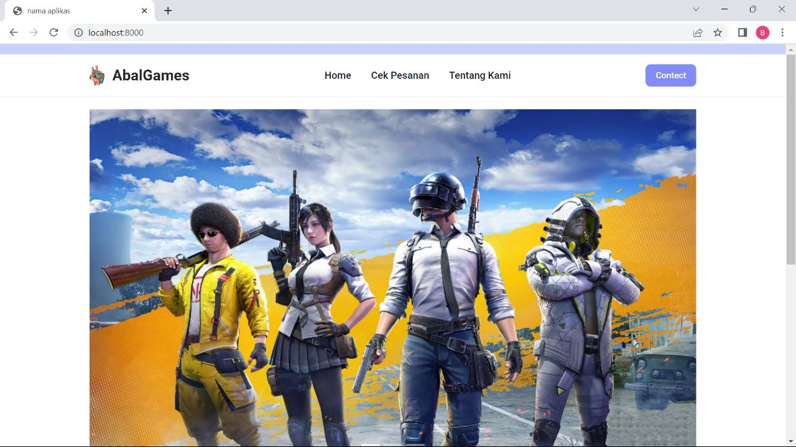

## Deskripsi Projek
# AbalGames

 AbalGames Top Up application provides a variety of popular game options that can be refilled, both mobile and PC games. Users simply select the desired game, enter the game ID, and select the desired top up amount. Payments can be made via a variety of available methods, including bank transfers, electronic payments, or credit cards.


## Installation

To get started with AbalGames, follow the steps below:

1. Install the required dependencies by running the following command:
```composer install --ignore-platform-req=ext-gd```

2. Generate a unique application key by running the following command:
```php artisan key:generate```

3. Migrate the database tables and seed them with initial data by running the following command:
```php artisan migrate --seed```

4. Ignite the App:
```php artisan serve```


## Anggota Kelompok 4

  - Muhammad Abbyan Khairi (2008001010010)
  - Said Rizki Ananda Putra (2008001010042)
  - Naufal Alvi Syahri (1908001010035)
  - Muhammad Syafiq (1908001010013)
